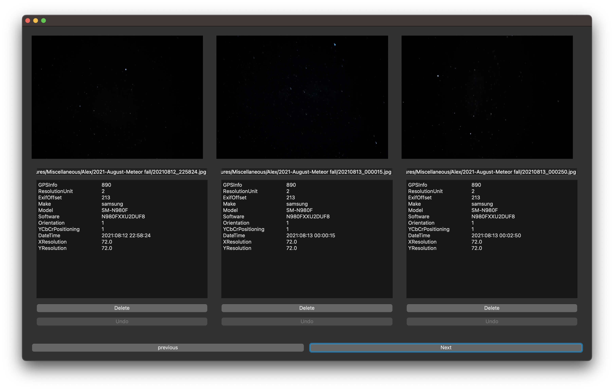
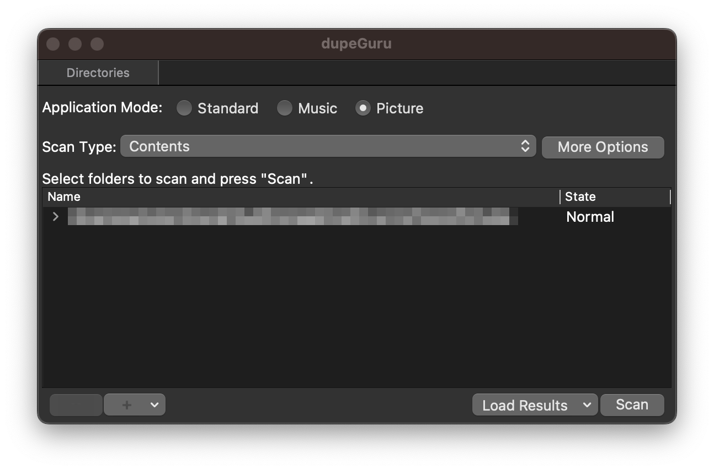
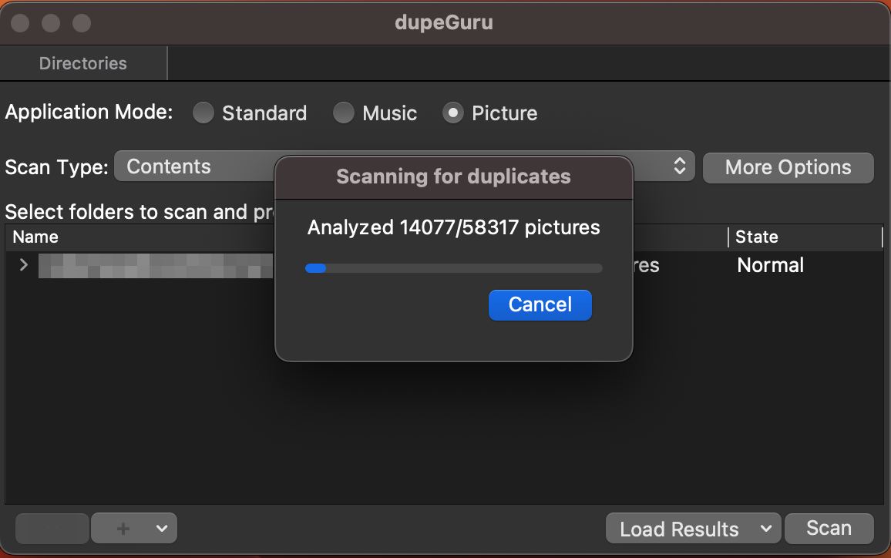
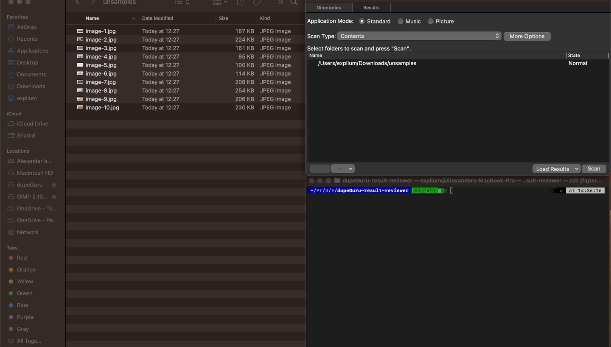

# dupeGuru-reviewer

## Background

[dupeGuru](https://dupeguru.voltaicideas.net/) is a tool that allows you to find duplicate files on your computer.
dupeGuru is good with pictures. it has a specific picture mode that allows you find quickly duplicated pictures.

although dupeGuru is a great tool it doesn't provide you with conveniently file compare.

## About

This results reviewer is a complementary tool for dupeGuru app and it allows review and compare matching pictures/videos and to delete the unwanted duplicates.

## Download

| OS    | Architecture          | Type | Link                                                                                                  |
| ----- | --------------------- | ---- | ----------------------------------------------------------------------------------------------------- |
| MacOS | Arm64(Apple Silicone) | app  | [dupeGuru-reviewer-arm64.tar.gz](https://github.com/ExpliuM/dupeGuru-reviewer/raw/main/dist/dupeGuru-reviewer-arm64.tar.gz) |
| MacOS | Arm64(Apple Silicone) | dmg  | [dupeGuru-reviewer-arm64.dmg](https://github.com/ExpliuM/dupeGuru-reviewer/raw/main/dist/dupeGuru-reviewer-arm64.dmg)    |

## ScreenShots



## dupeGuru - Use instructions

In oder to use this app you need to generate `results.dupeguru` file by scanning and exporting results from [dupeGuru](https://dupeguru.voltaicideas.net/) app.

1. Run dupeGuru
   
2. Scan the requested folder.
   
3. Export the results to the `workspaceFolder` of this project.
   
   

## Use instructions

1. Run dupeGuru-result-reviewer by typing `./run.sh`
   
2. Enjoy

\*\* in case that `results.dupeguru` file will not be located under the workFolder, file dialog will pop up.
\*\* notice that `delete` button actually moves the picture/video file to a TMP folder, in case you regret it you can `undo` it.

## Usage example



## Prepare

```terminal
./prepare.sh
```

## Run

```terminal
./run.sh
```
